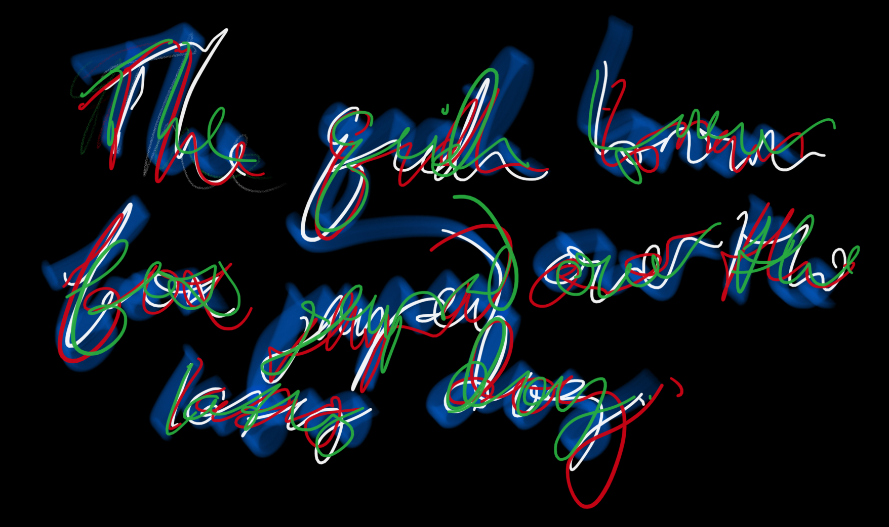

# Ryan Tuck

Hello, World. 

## Technical

### [ryantuck.io](http://ryantuck.io)

My website is http://ryantuck.io and it's hosted [here on replit.com](https://replit.com/@ryantuck/ryantuck). That links out to all sorts of stuff. [Here](https://github.com/ryantuck/website#readme) is how it's all set up.

### Technical writing on Stack Overflow

I've asked [many questions on Stack Overflow](https://stackoverflow.com/users/1700270/ryantuck?tab=questions) and have also [answered about half that number](https://stackoverflow.com/users/1700270/ryantuck?tab=answers) - this is probably the best collection of my technical writing. 

I strongly recommend asking questions online to hone this skill in addition to actually solving your problem by soliciting crowd wisdom. I also strongly recommend paying it forward. 

> '"Man desires not only to be loved, but to be lovely." - Adam Smith' - Russ Roberts

### Technical / Etc

- A few years ago I built a crude Bayesian model for fantasy football in pure python, as an exercise in understanding. [Here's a well-structured ipython notebook demonstrating differentiating great and bad QBs from one another](https://github.com/ryantuck/lombardi/blob/master/bayes_qb_tds.ipynb). It's pretty cool.
- [108 words translated into 8 different languages](https://github.com/ryantuck/translate-words/blob/master/output.csv) using the Google Translate API
- Some [bingo probabilities in ipython](https://github.com/ryantuck/bingo/blob/master/scratch.ipynb)
- A [python jigsaw puzzle generator](https://github.com/ryantuck/puzz)
- My [notes for setting up a new macOS machine](https://gist.github.com/ryantuck/73b8df1b2aa728af01bc47ac364a205a)

## Professional

Here is [the last version of my resume, from 2020](https://github.com/ryantuck/ryantuck.io/blob/master/static/resume.pdf)

### 2020 to Present - Songspace

I currently work as a data engineer at Songspace, where I lead the Data Exchange team responsible for data ingestion and exports. Serverless framework, lambda, pydantic (and typer), functional programming, jq, make, and good old unix pipes.

### 2015 to 2020 - Warby Parker

My prior employer, Warby Parker, offered me my first official programming job back in 2015, where I went in five years from junior engineer to tech lead of data engineering, focused on Business Intelligence. I did just about everything while there was runway to work on anything, and did really good work. Here's [an interview I did](https://www.codecademy.com/resources/blog/data-engineer-warby-parker/) with Codecademy about some of it. SQL, python, dbt, AWS, GCP, BigQuery, PostgreSQL, Looker.

### 2012 to 2014 - LIT

My friend Danny Kern and I built the world's best LED rave gear, but [only raised $17k on Kickstarter](https://www.kickstarter.com/projects/litlitlit/halo-rave-gear-revolutionized) and couldn't fund an initial production round. [Here's the Arduino-friendly source code repo](https://github.com/ryantuck/lit-halo) if you want to pick up the torch. Premature optimization is the root of all evil. C++, Arduino, PCB design, electrical engineering - hacking, really.

### 2007 to 2012 - College

I attended Northeastern University, studied physics and philosophy, and have a diploma to prove it sitting somewhere in my organized basement.

## Various Digital Collections

- My [Highlights from 120+ articles I read on my phone in 2021](https://roamresearch.com/#/app/tuck/page/nk6SpiSVo)
- My [Twitter / @ryntck](https://twitter.com/ryntck)
- My [GitHub Repos](https://github.com/ryantuck?tab=repositories)
- My [GitHub Gists](https://gist.github.com/ryantuck)
- [ ] Google Keep

## Some Structured Thinking

- My [Roam Summary of _The Life Changing Magic of Tidying Up_ by Marie Kondo](https://roamresearch.com/#/app/tuck/page/3TcMmIyPF)
- My [Roam Summary of _How to Take Smart Notes_ by Sönke Ahrens](https://roamresearch.com/#/app/tuck/page/yy7oqb4so)
- My [Notes on the Fermi Paradox](https://gist.github.com/ryantuck/a82d7344619644f61978d4eba7ce7c8b)
- My [Notes on _4HL_](https://roamresearch.com/#/app/tuck/page/tBiEf8Ghq) a la [Paul Skallas](https://twitter.com/paulskallas)
- My [Notes on _Superintelligence_ by Nick Bostrom](https://gist.github.com/ryantuck/a6b4b0303eddb3bd250ee97f2bde7f9d) from 2016 (holds up, even scarier now!)
- My [highlights from _The Bullet Journal Method_](notes-bullet-journal.md)

## Etc

- My [Eulogy for my iPhone 7](https://roamresearch.com/#/app/tuck/page/zlTpqAgmh)

> "VIP is always bettah, Vivian. You just have to be willing to do the work." - Anna Delvey

[`commit history for this file`](https://github.com/ryantuck/ryantuck/commits/master/README.md)
