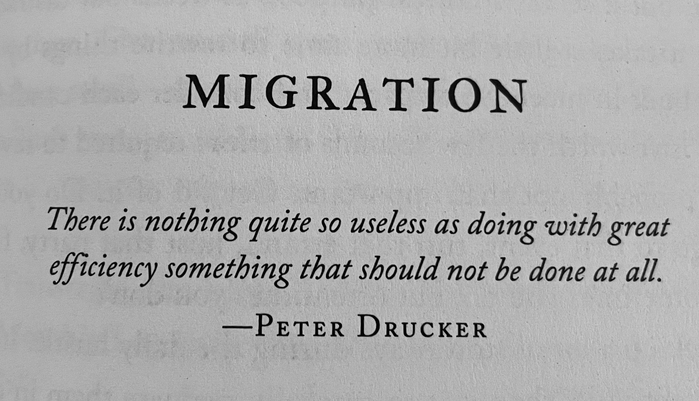
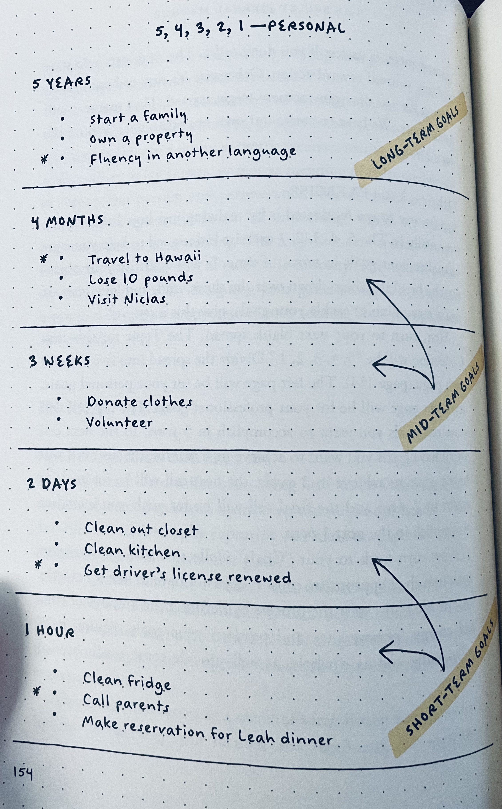
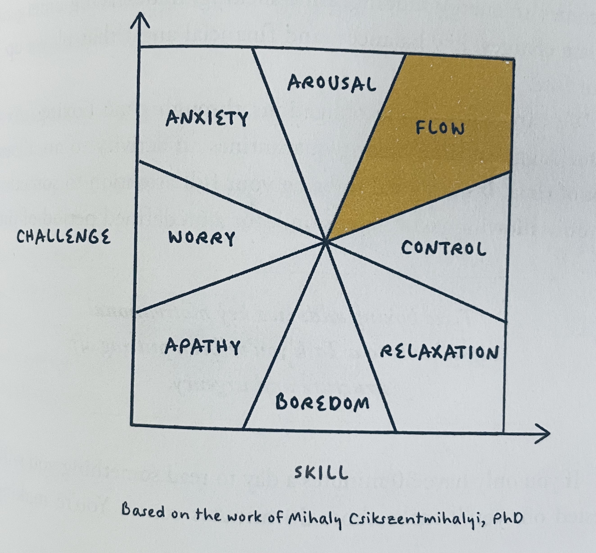

# Notes / Bullet Journal Method

This isn't about bullet journaling.

My friend Casey lent me _The Bullet Journal Method_ by Ryder Carroll because we were nerding out about note-taking.

I appreciate the methodology but have been so far down the zettelkasten rabbit hole lately that I couldn't imagine going back to a single notebook like some kind of wild animal.

Three other tangential ideas stood out.

## There is nothing so useless as doing with great efficiency something that should not be done at all

> There is nothing so useless as doing with great efficiency something that should not be done at all. 
> - Peter Drucker

## 5 years, 4 months, 3 weeks, 2 days, 1 hour

Why is this so much more satisfying than other very similar concepts? Because it's clearer or because the numbers are cute?

## Flow is up and to the right on the challenge/skill graph

